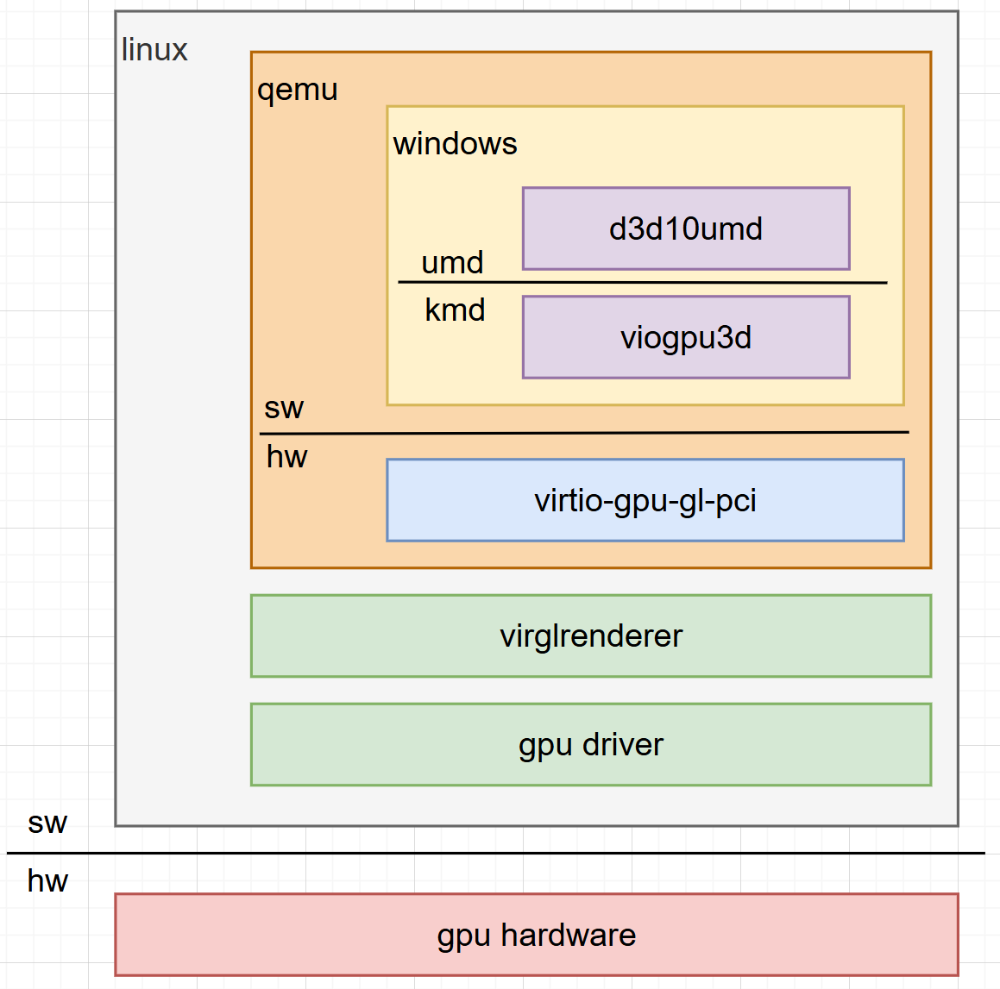

# VirtIO GPU Windows Driver
- According to the Windows Display Driver Model (WDDM) and DirectX specifications, a GPU driver consists of two components: KMD (Kernel Mode Driver) and UMD (User Mode Driver).
- In this project, KMD corresponds to `viogpu3d`, and UMD corresponds to `d3d10umd`.
- The whole architecture is like the following:

<div align="center">
    
</div>

- Terminology used in this document:
- **Host machine**: The Windows system used to build the driver and run WinDBG.
- **Target machine**: The Windows system where the driver is installed and APP are executed.

## 1. Prerequisites
- On the **host machine**, install the following tools:
- Visual Studio with C++ development workload.
- Windows Driver Kit (WDK) for Windows 10 or later.
- After installation, the following tools will be available:
- 1. Visual Studio IDE
- 2. WinDBG (for kernel-mode debug)
- 3. msvsmon.exe (for remote user-mode debug)

## 2. Building The Driver

### 2.1 Build KMD (`viogpu3d`)
- This is KMD under windows WDDM architecture.
- On the **host machine**, open the Visual Studio solution `build/virtio-gpu-win.sln`.
- Select the appropriate build configuration (e.g., `Release / x64`).
- Build the `viogpu3d` project, it will generate `viogpu3d.sys` as KMD, and `viogpu3d.inf` as driver installation file.

### 2.2 Build UMD (`d3d10umd`)
- This is the UMD under windows WDDM/DirectX architecture.
- Cause several .c & .h files are generated by python script in mesa project, so we need run the bat script `build/d3d10umd/gen-mesa-file.bat` firstly.
- On the **host machine**, open the Visual Studio solution `build/virtio-gpu-win.sln`.
- Select the appropriate build configuration (e.g., `Release / x64`).
- Build the `d3d10umd` project, it will generate `d3d10umd.dll` as UMD.

## 3. Installing Driver
- Cause the driver without signature could not be installed on Windows, we need to disable the signature check on **target machine**.
- There are several ways to disable the signature check:
- 1. Input the following cmd as Administrator in cmd, and restart the **target machine**:
```cpp
bcdedit /set {current} testsigning on
```
- 2. Run WinDBG on **host machine**, connect to **target machine** via kernel debug mode.
- Then the **target machine** will be in debug mode, and the signature check will be disabled automatically.
- Method (2) will be described in detail in the following section 4.1.

## 4. Debug Driver

### 4.1 Debug KMD Driver
- **TODO**

### 4.2 Debug UMD Driver
- On **target machine**, install the Graphic Tools in Settings / Optional Features.

#### 4.2.1 Using a Debug Version of UMD
- Adjust GPU driver registry settings if necessary (debug purposes):


- Build a Debug version `d3d10umd.dll`, and place it in the same directory as the APP executable.
- DirectX will load the UMD in the following order: 1) APP folder, 2) System32 folder.
- This allows: 1) the current APP to use the Debug UMD; 2) other APP to continue using the release UMD from System32.

#### 4.2.2 Remote Debugging with Visual Studio
- On the **host machine**, there is `msvsmon.exe` in Visual Studio package, copy it to **target machine** and run it as Administrator.
- On the **host machine**, use Visual Studio to remote launch the APP on the **target machine**.
- Debug the UMD directly from Visual Studio.

